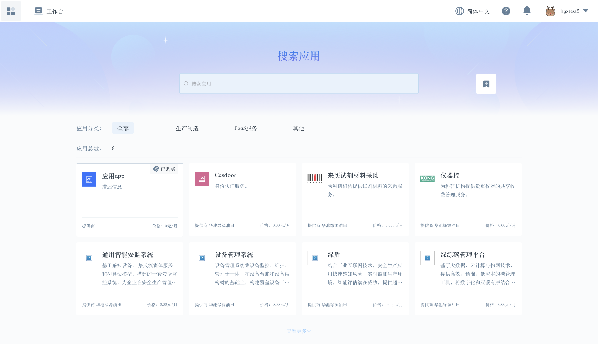

## 整体介绍

用户成功登录后进入工作台页面

1、右上角显示个人账号相关信息

快速切换平台各个子模块访问入口

点击用户名可以查看个人中心相关操作项、状态、退出登陆按钮

**最近访问**

根据用户访问轨迹将最近访问过的服务模块显示出来，便于快速开始之前的工作。

**我的应用**

用户当前可以访问的应用集合。

点击上方工作台按钮回到初始工作台页。

## 消息中心

消息中心旨在为平台各个服务模块提供标准的短信、邮件、站内信等服务。用户通过消息列表可以接收来自平台、企业内部不同层级的信息传递。方便信息在平台、企业组织不同层级流动。

消息涉及发送方和接收方。主要以创建任务的形式来灵活配置发送的内容、时间、时机、触达范围。

点击工作台页面上方图标进入消息中心。

当图标上带有小红点代表有未读消息。

## 账号中心

账号相关信息集中在账号中心进行管理，由基本信息、联系信息、企业信息及账号注销四部分组成。

用户可以更新密码，绑定邮箱及手机号并完成验证。可以修改企业简称。

如果不再继续使用平台可以选择注销账号。注销成功后企业范围内用户将无法正常访问。

## 费用中心

平台支持针对应用服务的交易行为。和应用相关的企业涉及买方和卖方两大类。卖方具体指服务商企业。买方是指从应用市场获取应用的所有企业。费用中心核心功能主要提供订单管理。可以查看全部交易记录及相关详情。

## 审计中心

审计中心的核心目标是记录用户在平台的关键行为事件。可以进行历史行为追溯从而满足审计、管理等需求。

普通用户可以查看到自己的操作行为记录、企业管理员可以查看自己企业范围内的操作行为记录。平台运营可以查看到整个实例级别的操作行为记录。

## 工单中心

工单中心是用户和平台运营双方之间沟通反馈问题的渠道。预置了多种类型的工单可供用户创建。整个流程用户可以提交问题描述、上传附件说明问题等待平台工作人员处理。直到问题解决后关闭流程。

## 应用市场

应用是开发者向内部或外部用户提供服务的载体。通常表现为各种业务管理系统等形态。服务商在入驻平台后，需要通过创建应用和开通相关权限的方式获取各种能力。根据实际需要开发个性化的应用，打造高效的数字应用生态。服务商将自己的系统应用像放在集市一样开放共享出来，供所有人使用。

快速浏览应用市场里的应用

## 服务商中心

平台提供基础公共服务能力，应用作为承载不同行业、不同领域具体业务的对象是平台核心资产。平台鼓励更多的第三方应用服务商加入平台贡献应用。企业也可以在内容通过开通服务商中心模块的形式将该能力开放给应用提供团队。向平台注入源源不断的应用生态。

应用市场是平台集中对外共享应用的地方。这里的应用按照应用分类进行细分。可以查看应用的详细信息。快速获取应用服务。

在使用前需要自助开通服务商中心模块，前提要求已经完成实名认证确保服务商的可靠性。

然后就可以进入服务商中心开始应用接入流程了。

创建好应用后即可进入应用内部进行配置。包含有应用详情配置、上架方案配置、角色配置。

我的订单

上架到应用市场的应用被获取后，所产生的交易订单可以进行查看。

收款管理

绑定收款账号，一但交易成功平台会将分佣直接打款到该账户。

## IAM

不同用户对系统权限管理的掌控程度或许是不一样的，但是都需要集中有一个模块对此进行处理。IAM服务模块便是提供权限管理一整套能力的模块。可以通过它完成组织架构搭建维护、应用授权管理等核心操作。

一个实例下可以创建多个组织。通过组织进行逻辑隔离。一个组织可以对应一个集团下面的不同子公司或者公司外部的协作客户。可以进行创建并配置组织管理员。

用户管理

不同的组织内部可以独立进行组织内用户管理。

组织管理员将组织成员添加到组织里。

组织内项目授权
选择将要授权给那些用户，以及相应拥有哪些角色权限。

组织外项目授权
选择组织外的平台其它组织，将相应角色权限授予给该组织。

