## **快速开始指引**

## 介绍

在快速入门指南中，我们将学习一些关于如何做用户管理和应用程序权限管理的基础知识。然后作为示例，我们将使用平台接入一个基于React的单页应用程序。示例应用程序允许用户使用OIDC协议安全地登录。

## **产品术语**

**实例、组织、项目、用户、角色、授权及应用程序**

在产品中，实例、组织、项目、用户、角色和应用程序是构成平台的主要内容。

上述内容的创建顺序通常如下：

- **实例**：实例是产品中的顶级实体，代表平台的独立部署。一个实例可以有一个或多个组织。

- **组织**：组织是代表公司/组织在实例中的逻辑分离，一个组织可以有一个或多个项目。默认组织是帐户注册过程开始时提供的组织。通常，一个实例将有一个组织，但在B2B场景中，一个实例将有多个组织。

- **项目**：项目是组织内部的逻辑分离，是其所包含资源的应用程序、角色和授权策略的容器。

- **用户**：用户是在组织层面创建的，并被授予对项目内资源的访问权限。可以为他们分配不同的角色，这定义了他们在项目中拥有的权限和特权。

- **角色**：角色是分配给项目内用户的权限和特权集。

- **授权**：授权策略是在项目级别定义的，这意味着它们适用于项目内的所有资源。这些策略是基于分配给用户的角色来的，它们决定了用户在项目中允许执行的操作范围。

- **应用程序**：应用程序是在项目中开发和管理的应用程序。它们可以是使用项目内资源的客户端应用程序，也可以是为其他应用程序提供资源供其他应用程序使用的后端应用程序。这些应用程序可以使用OIDC或SAML协议来验证用户访问受保护的资源。

上述内容的创建顺序可能因组织的具体需求和要求而异。

## 注册租户账号

1、前往

[https://portal-console.energy-envision.com/](https://portal-console.energy-envision.com/)  并且点击“立即使用”。

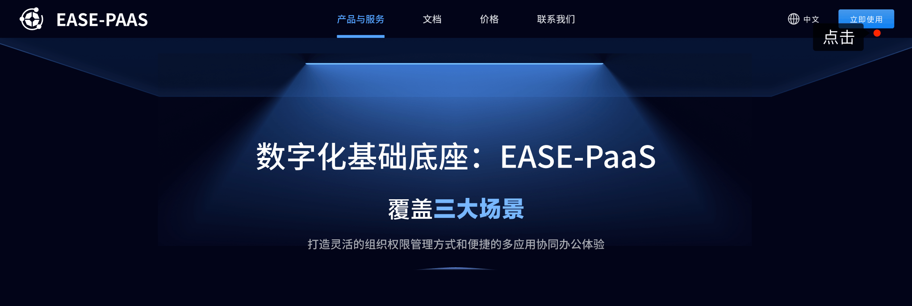

2、您可以通过输入您的电子邮件地址进行注册。输入您的电子邮件地址，完成您的详细信息。然后单击“注册”。

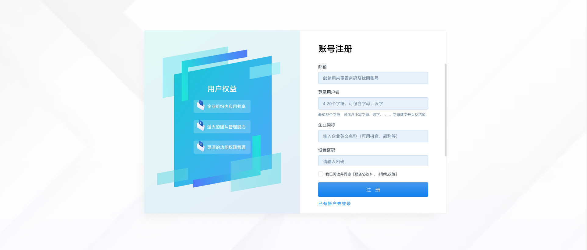

3、账号创建成功后，如下如所示。

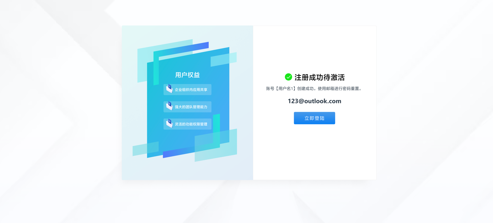

4、点击“立即登陆”跳转登录页面。

5、输入用户名后。您现在必须验证您的电子邮件地址。

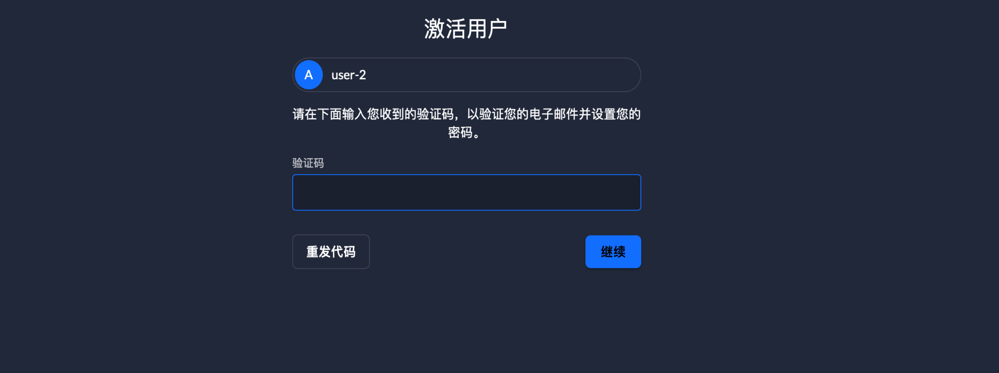

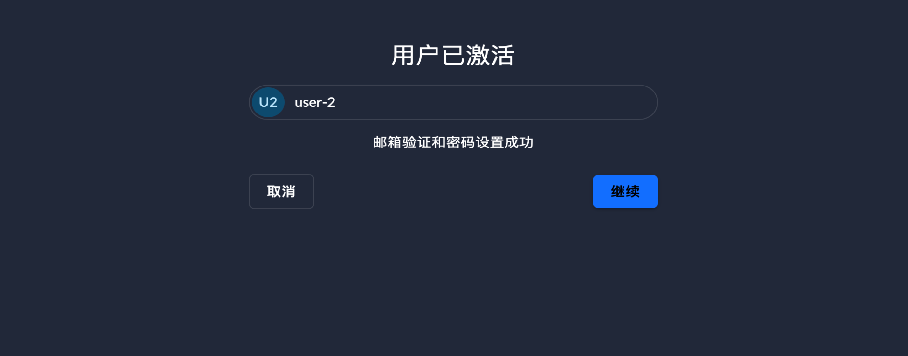

6、完成邮箱验证后，通过设置的密码成功登录。进入工作台界面。

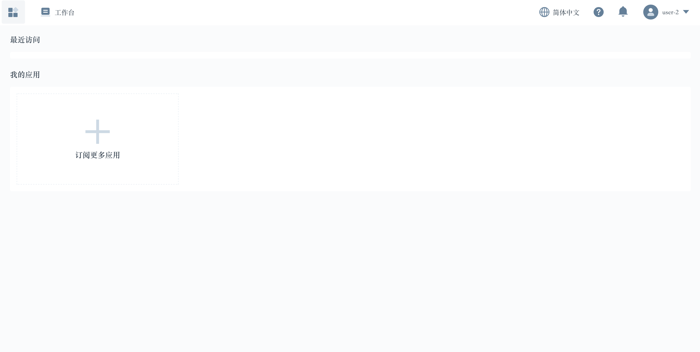

## 完成实名认证

新注册的管理员账号初始没有进行实名认证，完成认证后将获得额外的能力。例如：添加组织成员、组织内权限管理。

1、查看账号信息。

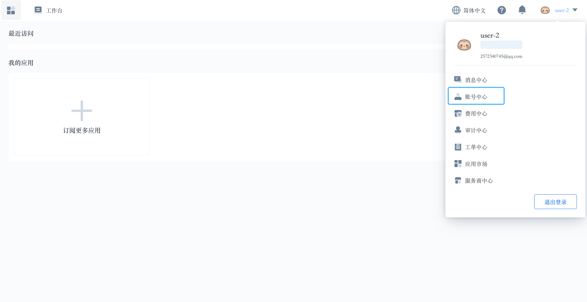

2、显示为未实名认证状态，进入实名认证页提交信息向平台运营申请认证。

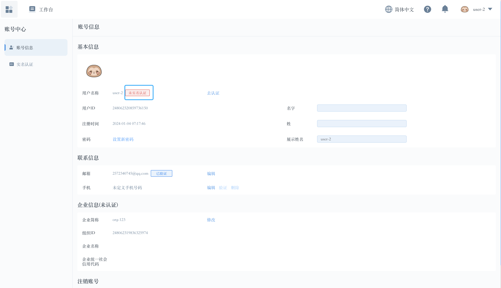

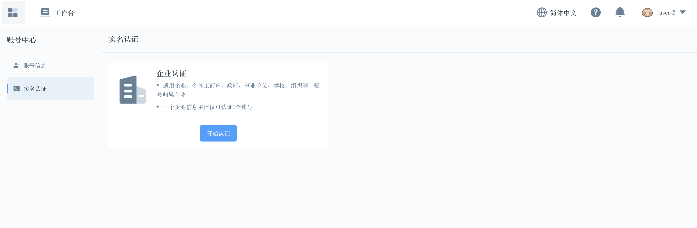

3、点击开始认证按钮，根据要求填写信息然后提交审核。等待平台运营人员审核。

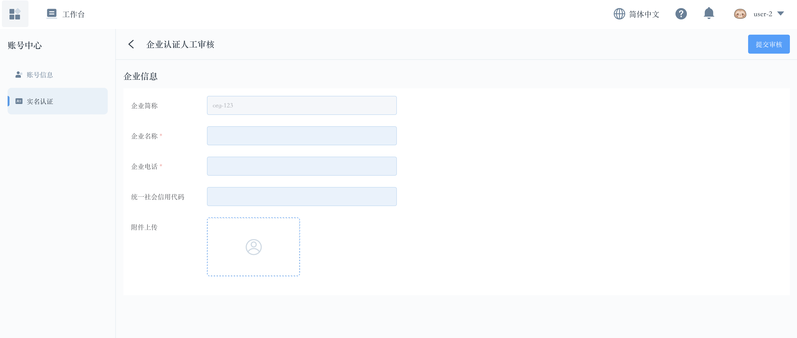

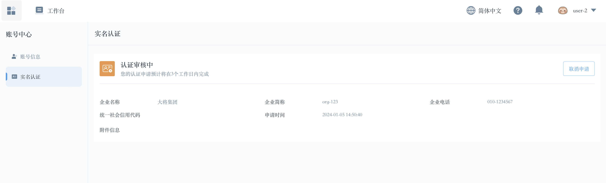

## 添加租户成员

1、通过实名认证后，组织管理员从右上角可以看到新增IAM功能项。

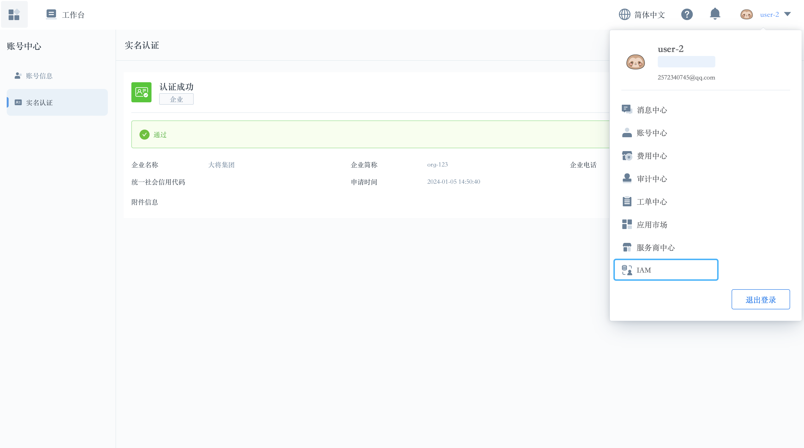

2、进入 IAM模块，通过用户管理添加新的组织成员。

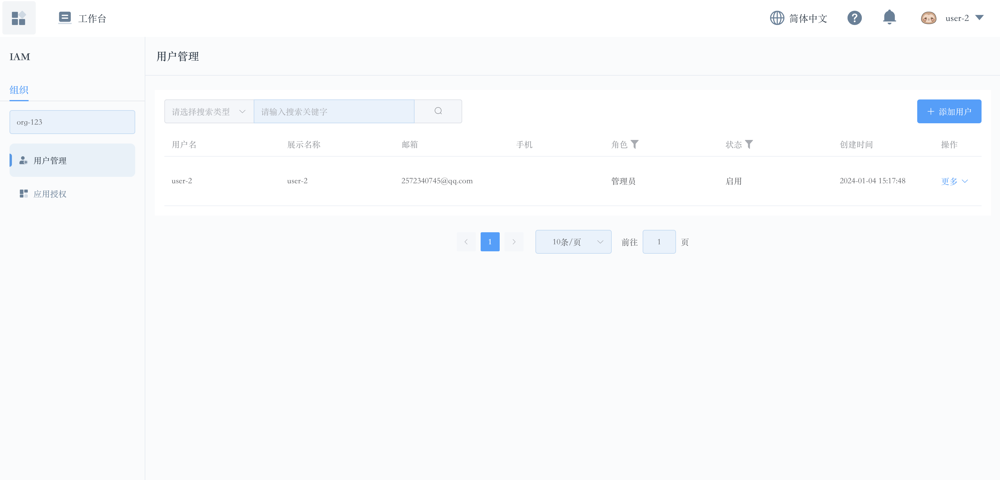

## 开通实例

独立的实例可以让用户完成体验所有功能。特别是作为平台的拥有者负责运营整个平台、处理关键流程等。配置平台自身基础设置。

1、初始注册好的账号登录工作台后，可以在工作台看到实例开通提示。

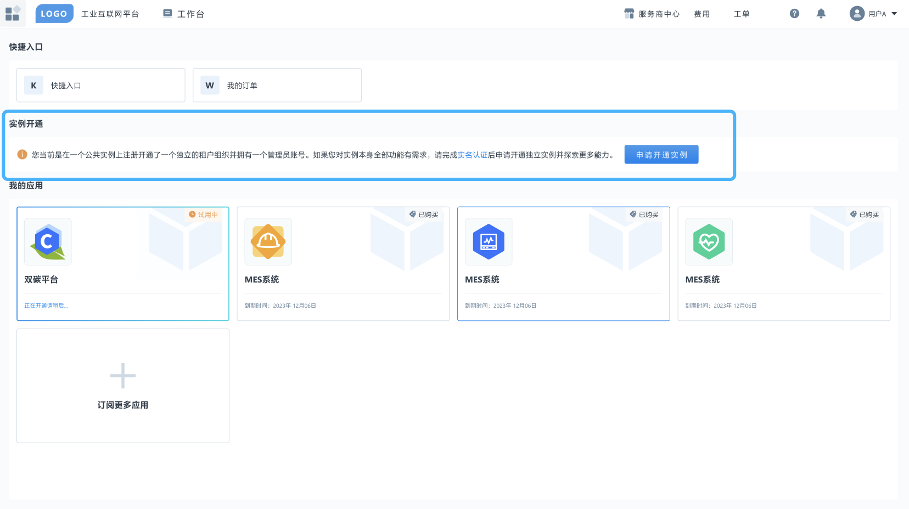

2、申请开通实例前需要先完成实名认证流程。

3、完成实名认证后，开始申请开通实例。用户以工单形式发起申请，等待平台处理。

